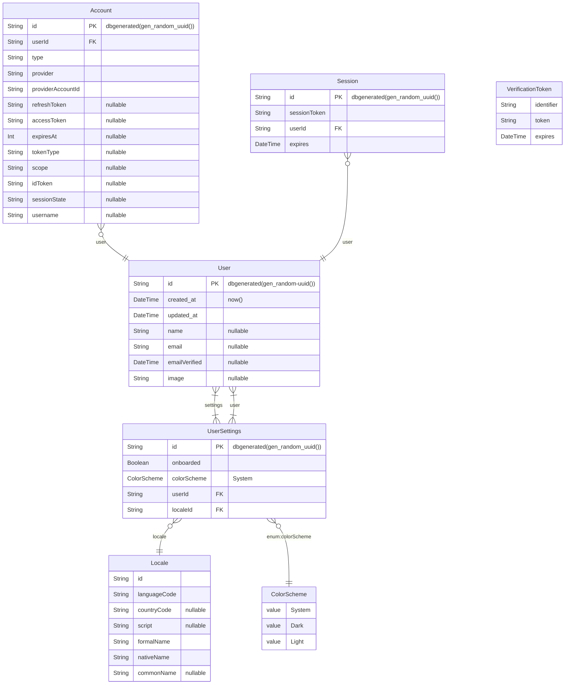

```mermaid
erDiagram
	ColorScheme {
		value System
		value Dark
		value Light
	}
	User {
		String id PK  "dbgenerated(gen_random-uuid())"
		DateTime created_at  "now()"
		DateTime updated_at
		String name  "nullable"
		String email  "nullable"
		DateTime emailVerified  "nullable"
		String image  "nullable"
	}
	UserSettings {
		String id PK  "dbgenerated(gen_random_uuid())"
		Boolean onboarded
		ColorScheme colorScheme "System"
		String userId FK
		String localeId FK
	}
	Locale {
		String id
		String languageCode
		String countryCode  "nullable"
		String script  "nullable"
		String formalName
		String nativeName
		String commonName  "nullable"
	}
	Account {
		String id PK  "dbgenerated(gen_random_uuid())"
		String userId FK
		String type
		String provider
		String providerAccountId
		String refreshToken  "nullable"
		String accessToken  "nullable"
		Int expiresAt  "nullable"
		String tokenType  "nullable"
		String scope  "nullable"
		String idToken  "nullable"
		String sessionState  "nullable"
		String username  "nullable"
	}
	Session {
		String id PK  "dbgenerated(gen_random_uuid())"
		String sessionToken
		String userId FK
		DateTime expires
	}
	VerificationToken {
		String identifier
		String token
		DateTime expires
	}
	User }|--|{ UserSettings : settings
	UserSettings }|--|{ User : user
	UserSettings }o--|| Locale : locale
	UserSettings }o--|| ColorScheme : "enum:colorScheme"
	Account }o--|| User : user
	Session }o--|| User : user

```
